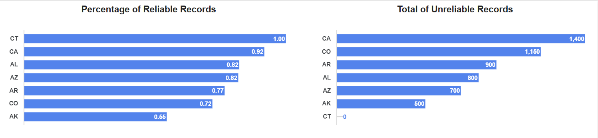

# 🏥 Hospital Patient Experience Analysis (2017–2018)
### Understanding patient experience across seven U.S. states through reliability-aware analysis

  

---

## ⭐ Overview

This project analyzes hospital patient experience survey data across **7 U.S. states**  
**(AL, AR, AK, AZ, CT, CO, CA)** covering the period:

📅 **July 2017 – June 2018**  
🏥 **695 hospitals**  
📊 **Multiple patient experience measures**

The goal of this analysis is to tell a clear, meaningful story about patient experience while ensuring **data reliability** remains central to the interpretation.

This page provides:
1. **The insights**  
2. **The visuals**  
3. **The narrative behind the findings**  

All SQL, data cleaning steps, and documentation are linked but intentionally secondary — the focus is on **insight, clarity, and communication**.

---

## 🎯 Project Objectives

- Evaluate **data quality** using footnote-based reliability indicators  
- Identify **state-level trends** in patient experience  
- Understand variation across core themes like:  
  - Communication  
  - Cleanliness  
  - Discharge information  
  - Likelihood to recommend  
- Present insights visually and clearly for stakeholders  
- Avoid misleading comparisons due to skewed hospital counts (e.g., California making up ~50% of the dataset)

---

## 🔍 Why This Project Matters

Patient experience surveys influence:
- Medicare reimbursement  
- Quality ratings  
- Public hospital rankings  
- Community trust  

But the results are only meaningful **if the underlying data is reliable**.

This project begins by identifying and quantifying **unreliable & footnoted data**, then builds insights from a clean, trustworthy foundation.

---

# 🔧 Data Quality & Reliability

**Before** interpreting patient experience results, the dataset was evaluated for reliability:

### ✔ Footnotes were decoded into:
- Insufficient sample size  
- Partial year data  
- Suppressed or unreliable values  
- No footnote (fully reliable)  

### ✔ Each row was labeled:
- **Reliable**
- **Unreliable**

This allows all charts and insights to be filtered or annotated accordingly.

> Data reliability is the foundation of the story.

---

# 📊 Visual Insights  
(*You will replace these with your Looker Studio screenshots later*)

Below is the structure for your visuals, each with a caption and explanation — hiring managers love this format.

---

## 📍 1. Data Reliability by State

**Purpose:** Understand which states have the highest % of reliable survey records.

➡ Reveals blind spots in survey participation and data completeness.

**Key takeaway:**  
  
States like **CT and CO** show the strongest reliability, while **AK** has notable reliability gaps due to small sample sizes.

---

## 📍 2. Distribution of Reliable vs. Unreliable Records

**Why it matters:**  
Stakeholders should know what portion of the dataset can be trusted before interpreting metric scores.

---

## 📍 3. Average Scores by Experience Category (Reliable Data Only)

**Measure groups visualized:**
- Nurse Communication  
- Doctor Communication  
- Cleanliness  
- Discharge Information  
- Likelihood to Recommend  
- Overall Hospital Rating  

**Example insight:**  
Communication measures tend to score consistently higher than cleanliness and noise-related measures.

---

## 📍 4. Variation Across States by Category

**What it shows:**  
Which patient experience themes vary the most from state to state.

---

## 📍 5. Survey Engagement (Response Rates & Survey Counts)

**Purpose:**  
Show how patient engagement varies across states — high engagement often correlates with more reliable data.

---

# 🧠 Key Insights

Here’s the section where you shine.  
This is written in clear, business-friendly language:

### ✔ Insight 1 – Data reliability varies drastically by state  
This impacts how trustworthy certain metrics are and shapes how results should be interpreted.

### ✔ Insight 2 – Communication measures consistently outperform environmental measures  
Nurse and doctor communication show higher and more stable satisfaction compared to cleanliness and quietness.

### ✔ Insight 3 – States show unique experience patterns, even when controlling for reliability  
Some states excel in communication measures but lag in environmental ones, and vice versa.

### ✔ Insight 4 – Response rate patterns highlight important engagement differences  
States with lower survey participation may underrepresent specific patient groups or experiences.

---

# 📝 Executive Summary

This project demonstrates a reliability-first analysis approach to healthcare experience data.  
By identifying footnote-driven reliability issues upfront, the analysis avoids misleading comparisons and focuses on **state-level themes**, where sample sizes and representation are stronger.

The insights reveal clear patterns in patient communication, environmental experience, and survey engagement — providing a meaningful view into how patients experience care across the selected states.

---

# 📁 Project Structure

---

# 🛠 Tools Used

- **SQL (BigQuery)** — cleaning, extraction, categorization  
- **Looker Studio** — visual dashboards  
- **Python (optional)** — exploratory checks  
- **GitHub Pages** — project presentation  

---

# 📬 Contact

If you'd like to discuss this project, collaborate, or review SQL/visuals in detail, feel free to reach out.

